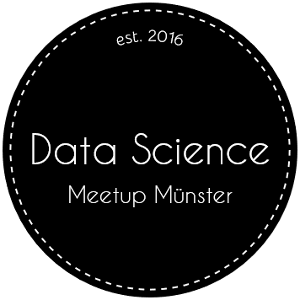

# resources
Links to newsletters etc. to learn and keep informed about data science
...and always the name of the person in parentheses that recommends the resource

## Newsletters
- [Data Machina](http://datamachina.com) (Tobias Pfaff)
- [Data Science Weekly](http://datascienceweekly.org) (Tobias Pfaff)
- [O'Reilly Data Newsletter](http://www.oreilly.com/data/newsletter.html) (Tobias Pfaff)
- [KDnuggets](http://www.kdnuggets.com) (Tobias Pfaff)

## Talks
- [Getting In Shape For The Sport Of Data Science](https://www.youtube.com/watch?v=kwt6XEh7U3g) (Tobias Pfaff) 

## Online courses
- [Machine Learning, Andrew Ng, Stanford University](https://www.coursera.org/learn/machine-learning) (Tobias Pfaff)
- [Machine Learning für Einsteiger, Nando de Freitas](https://www.youtube.com/playlist?list=PLE6Wd9FR--Ecf_5nCbnSQMHqORpiChfJf&feature=view_all) (Florian Kleene)
- [Machine Learning für Fortgeschrittene, Nando de Freitas](https://www.youtube.com/playlist?list=PLE6Wd9FR--EdyJ5lbFl8UuGjecvVw66F6&feature=view_all) (Florian Kleene)

## Tutorials
- [Deep Learning Tutorials](http://deeplearning.net/reading-list/tutorials/) (Omer Maqsood)
- [Data Science is Software](https://github.com/drivendata/data-science-is-software/tree/master/slides) - How to better organize your data science project [also as [video](https://www.youtube.com/watch?v=EKUy0TSLg04)] (Tobias Pfaff)
- [End-to-End Deep Learning Tutorial](https://spandan-madan.github.io/DeepLearningProject/) (Tobias Pfaff)

## Books
- [Good Books for All Things Data](http://multithreaded.stitchfix.com/blog/2016/06/09/ds-books/) (list compiled by Hilary Parker and Brian Coffey)
- [Conversations on Data Science](https://leanpub.com/conversationsondatascience) by Roger D. Peng and Hilary Parker (Daniel Nüst)

## Papers
- [ImageNet Classification with Deep Convolutional Neural Networks, Hinton et al.](http://papers.nips.cc/paper/4824-imagenet-classification-with-deep-convolutional-neural-networks.pdf) (Omer Maqsood)
- [Deep Learning, Le Cun et al.](https://www.cs.toronto.edu/~hinton/absps/NatureDeepReview.pdf) (Omer Maqsood)

## Podcasts
- [Not So Standard Deviations](https://soundcloud.com/nssd-podcast) (Daniel Nüst)

## Logo

